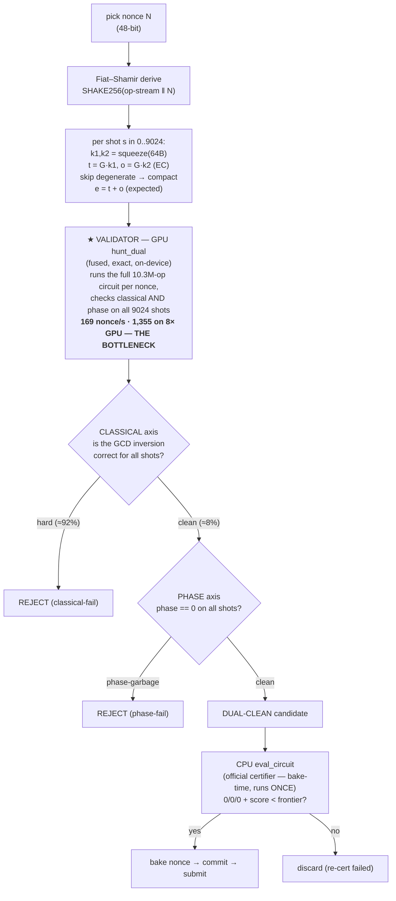

# ecdsafail — Nonce Search Pipeline (flow + where to speed it up)

> Goal of this doc: explain the **whole nonce-search pipeline** end-to-end (flowchart +
> text), give the **measured throughput** of each stage, pinpoint the **bottleneck**, and
> list the **levers to make the whole search faster** (ranked by payoff/effort).
> Numbers measured on frontier `84d5b0e`, zan3 (8× RTX5090), 2026-06-15.
> **2026-06-17 更新（`1caf521`, q1168）：** 见 §0.5——曾经静默破坏 hunt 的 stale-tool 陷阱、
> 强制对齐门、filter 校准、以及"该不该继续 hunt"的通道诊断。
>
> **⚠️ 当前主路径 = 两阶段（Lever B）。** 现在的 hunt 走 `leverB_hunt.sh`：**Stage-1**
> `gpu-nonce`/`gcd.cu` 解析预过滤（~8.6k–23.5k nonce/s/卡，拒 ~99.9%，不跑 op-loop）→ **Stage-2**
> `verify_dual`/`hunt_phase.cu` op-loop **只跑 ~0.09% 幸存者**。下面 §1 的流程图与 §4/§6 描述的
> **单阶段融合 `hunt_dual`**（op-loop 跑每个 nonce，~1,355 nonce/s on 8 GPU）是**更早的回退路径**，
> 已被两阶段取代（两阶段约 **15× 更快**：单阶段扫 12M nonce ≈2.5h，两阶段 ≈10min）。**注意
> ~1,355 nonce/s 是单阶段验证器在原始流上的速率，不是两阶段的扫描率**（两阶段扫原始 nonce 由
> Stage-1 主导、约 100× 于它）。两阶段的经济学见 §0.5 与 §5#1（现已 LIVE，非待办）。

---

## 0. Why we hunt at all

Score = `avg_executed_Toffoli × peak_qubits`. To beat the frontier you change the
op-stream (a truncation / new lever). **Any op-stream change re-rolls the Fiat–Shamir
test island**, so the baked `DIALOG_TAIL_NONCE` goes stale. You must **hunt a fresh
nonce** whose 9024-shot island is fully **CLEAN**: `0 classical mismatch / 0
phase-garbage / 0 ancilla-garbage`. Finding that nonce = the "nonce search".

- The nonce enters the circuit as **96 `X;X` tail ops** (identity on state, only perturbs
  the FS hash) — see `src/point_add/mod.rs` ~L1773. So "trying a nonce" = re-deriving the
  FS island for that hash, NOT recomputing the circuit math.
- A nonce must be clean on **two independent axes**:
  - **classical** — the GCD modular inversion produces the correct point-add output.
  - **phase** — the measured-uncompute (`Hmr`/`R`) leaves global phase 0.
  A winner = **dual-clean** (both, on all 9024 shots).

---

## 0.5 — 2026-06-17：曾静默破坏 hunt 的 stale-tool 陷阱（与修复后的工作流）

这是本轮最重要的运营级修复。它解释了为什么**对真正可 hunt 的候选,老 hunt 也"失败"(出不了 winner)**。

### Bug —— stale 编译的 `quantum_ecc` → 错的 island → 所有 verdict 都错

GPU hunt 工具(`circuit_prep`、`verify_dual`/`hunt_dual`、`gpu-nonce`)按 path(`../..`)
依赖 `quantum_ecc`。Cargo 的**增量编译可能在 frontier 源码已变之后,仍链接一份 stale 编译的
`build()`**——二进制 mtime 看着是新的,但依赖根本没重编。于是工具建出的电路**和官方分叉**
(本例:`circuit_prep` 比 `build_circuit` 少了 ~12,553 ops)。而 FS island 是
`SHAKE256(op-stream ‖ N)`,op-stream 一变 → **每个 nonce 的 island 都不同** →
**所有 classical/phase verdict 全错**。

**铁证:** 认证干净的 baked nonce(官方 `eval_circuit` 下 `0/0/0`)在 `verify_dual` 下被判成
**classical-fail**。在 stale 工具上 hunt,就算扫到 winner 也确认不了——候选看着像死的。
*这几乎可以肯定就是老 cb45 hunt "没成功"的真因。*

**修复:** `cargo clean` + 重建 gpu-nonce 工具——build 日志这时必须出现 `Compiling quantum_ecc`。
clean 重建后,baked nonce 又读成了 **dual-clean**。(注意:`circuit_prep` 的 n_ops 和
`build_circuit` 的 total_ops 之差**不是**可靠判据——`circuit_prep` 报的是 slot 压缩后的计数。
用下面的对齐门。)

### 强制对齐门（每次重建 / 换 frontier 后,hunt 前必做）

确认一个**已知干净的 baked nonce 在重建后的工具上读成 dual-clean**。`NONCE_BITS=48`,所以测
baked nonce 的**低 48 位**(官方 nonce 是 48-bit 有效;例如
`2150000021998006 & (2^48−1) = 179675185023414`)。若读到的不是 dual-clean,工具就是错位的——
**停下重新对齐,别 hunt。** 这个 baked-nonce 检查就是 per-channel-zero 对齐门,是避免拿一整个
fleet-小时去跑垃圾 verdict 的便宜保险。

### 改比较器的 knob 需要重新校准 filter（第二个静默失败模式）

凡是**改了 GPU filter 所建模的比较器**的候选(如 `DIALOG_GCD_COMPARE_BITS 46→45`),必须同时重建
dump(`circuit_prep`)**和** stage-1 filter,且**校准到新 knob**——给 `circuit_prep`、`gpu-nonce`、
`verify_dual` 都 export 这个 knob。用 cb=46 校准的 filter 去扫 cb=45 的电路,GPU-"clean" 候选验证
出来会卡在**高 cls floor**——这是一个看着像死路的**假结构-floor**。

### "该不该继续 hunt"的通道诊断（取代盲 hunt）

在投入长时间盲 hunt 前,先用(已对齐、已校准的)`verify_dual` 筛 ~900 个 GCD-clean 候选,读通道结构:

- **leak** `q = P(pha=0 | cls=0)`——classical-clean 候选里同时 phase-clean 的比例。本电路实测
  **leak ≈ 1**(~180 个 cls-clean 里 0 个 pha-clean)→ **phase 是独立的绑定通道,GCD 预过滤完全不
  富集它。** 所以必须扫得很深,而且**光加 stage-1 GPU 没用**(hunt 是 phase-eval-bound)。winner 仍
  存在(frontier 自己的 baked nonce 就是 dual-clean)→ 这是**深统计长尾,不是硬 floor**。
- **结构 floor vs 深尾**——把候选的画像(cls-clean 比例、leak、failbatch 谱)和一个**已知可 hunt 的
  基线 = live frontier 本身**对比。若一致,候选就是深尾(可 hunt,只是稀有),不是死路。*已验证:*
  cb45(179 cls-clean/900, leak≈1, max failbatch 43)与可 hunt 的 cb46 frontier(180/900, leak≈1,
  max failbatch 48)统计上一模一样 → **cb45 可 hunt**。严格版是 failing-shot overlap test
  (`DUMP_FAIL_SHOTS`,见 `nonce_time_estimation.md` §B):每个 nonce 都是同一批 shot 失败 → 结构(死);
  不同 shot → 统计(继续 hunt)。
- 注意 `900 里 0 dual-clean` **不等于**"没 winner"——cb46(可用的 frontier)在 900 里也 0;它的 winner
  是几百万 nonce 扫出来的。这正是深尾的特征。

### 新工作流为什么更好（之前 → 现在）

| | 之前（静默失败） | 现在（本轮） |
|---|---|---|
| stale 工具 | hunt 跑在分叉电路上;verdict 全是垃圾;扫到 winner 也确认不了 | **对齐门**(baked nonce → dual-clean)在 hunt 前就抓出来 |
| 改比较器的 knob | 用错位 filter 扫 → 假结构-floor | 重建 dump + filter,**校准到该 knob** |
| "出不了 winner" | 分不清结构死路 / 深尾 / 工具坏了 → 放弃了可 hunt 的候选 / 死磕死路 | **通道筛选**(leak + 对比 frontier 画像 + overlap test)在投 fleet 前给出判定 |
| 决策方式 | 盲 hunt,碰运气 | 筛选 → 判定 → 才投 fleet hunt;winner 用 CPU `eval_circuit` 复核 |

---

## 1. The pipeline (flowchart)



**The economics:** the classical axis can be decided by a **cheap analytical GCD replay**
(no circuit run). The phase axis can ONLY be decided by **running the full 10.3M-op
circuit** (phase depends on every gate + the measured-uncompute RNG). So the ideal
pipeline rejects the ~92% classical-fail nonces *cheaply* and runs the expensive phase
op-loop only on the ~8% classical-clean survivors.

**这一段描述的是【单阶段融合】路径（已被两阶段取代，见顶部 banner）。** The exact verification —
running the full 10.3M-op circuit and checking both axes — used to be a CPU stage
(`fast-screen`, ~9 s/candidate). It then **moved onto the GPU** as the fused
`hunt_dual` evaluator, which absorbs the nonce into the FS hash on-device and runs the
op-loop without a rebuild. But that single-stage validator *was* the bottleneck: because it
decides classical correctness **by running the op-loop** (`hunt_phase.cu` ~L252–294), it pays
the full 10.3M-op cost on **every** nonce — even the ~92% that are classical-fail — capping it
at **169 nonce/s** (1,355 across 8 GPUs). **解法（现已 LIVE，非待办）**：把那个*便宜的*经典
拒绝从 validator 移走——用解析 `gcd.cu` 预过滤作 Stage-1（~8.6k–23.5k/卡，不跑 op-loop），op-loop
（Stage-2）只跑 ~0.09% 幸存者。这就是 `leverB_hunt.sh` 两阶段、约 15× 于单阶段。唯一的 CPU 步是
bake 时官方 `eval_circuit` 对最终赢家跑 **一次** 做 ground-truth 复核。

---

## 2. The components (files on zan3, under the repo)

| component | path | role | runs the op-loop? |
|---|---|---|---|
| circuit build | `src/point_add/...` → `build()` | emits the 10.3M-op stream (`ops.bin`) | — |
| **eval_circuit** (official) | `src/bin/eval_circuit.rs` | reads `ops.bin`, full sim, **the certifier** | yes (CPU) |
| **fast-screen** (CPU agent) | `ecdsafail-agent/fast-screen/` | in-process build + full sim, 1 nonce/proc, single-thread | yes (CPU) |
| **gcd.cu / `gpu-nonce`** | `ecdsafail-agent/gpu-nonce/src/gcd.cu`, `main.rs` | analytical **classical** prefilter (GCD replay) | **no** (fast) |
| **hunt_dual / hunt_phase** | `ecdsafail-agent/gpu-nonce/src/hunt_phase.cu`, `bin/hunt_dual.rs` | fused GPU **classical+phase** evaluator (exact) | yes (GPU) |
| phase_sim_v2 | `…/src/phase_sim_v2.cu` | GPU phase op-loop (bit-sliced, validated) | yes (GPU) |
| circuit_prep | `…/bin/circuit_prep.rs` | dump remapped circuit (`/tmp/phase_circuit`) for the GPU kernels | — |
| phase_ref | `…/bin/phase_ref.rs` | CPU golden (FS + op-loop), matches eval_circuit bit-exact | yes (CPU) |
| validate_* | `…/bin/validate_*.rs` | correctness harnesses (kernel vs golden, gcd.cu vs CPU filter) | — |

Key mechanic: **the nonce is in the op-stream** (the X;X tail), and `eval_circuit` reads a
prebuilt `ops.bin`. So CPU verify of nonce N needs an `ops.bin` built with N baked. The GPU
kernels instead **absorb N into the FS hash on-device** (no rebuild) — that's why GPU can
stream millions of nonces. **Screening gotcha:** `eval_circuit` ignores env; rebuild
`ops.bin` with `build_circuit` (env honored there) first.

---

## 3. Measured throughput (84d5b0e, per-stage)

| evaluator | hardware | rate | notes |
|---|---|---|---|
| CPU `fast-screen` (full classical+phase) | 1 core | ~0.08 nonce/s (~12 s/nonce) | single-threaded |
| CPU fast-screen | NUMA0 (62 cores) | **~5 nonce/s** | |
| CPU fast-screen | full fleet (~470 cores) | **~40 nonce/s** | the historical bottleneck |
| GPU `gcd.cu` classical prefilter | 1 RTX5090 | **~8,640 nonce/s** | EC-derivation-bound; **but over-strict / misaligned — see §4** |
| GPU `hunt_dual` (classical+phase fused) | 1 RTX5090 | **~169 nonce/s** | runs op-loop on every nonce |
| GPU `hunt_dual` | 8 RTX5090 (independent procs) | **~1,355 nonce/s** | ≈ 34× the whole CPU fleet |
| GPU `phase_sim_v2` (phase op-loop only) | 1 RTX5090 | ~130 nonce/s | |

Circuit on 84d5b0e: **10,301,716 ops, 1170 qubits, ~806,771 classical bits, 9024 shots,
~1.35M measured gates (Hmr+R)/batch.** Empirical **classical-clean ≈ 8%**, **P(dual-clean)
≈ 3e-8** (so a fresh winner needs ~1e7–1e8 nonces scanned).

---

## 4. Where the time goes (the bottleneck)

The fused `hunt_dual` decides classical correctness by **running the op-loop and checking
the output** (`hunt_phase.cu` ~L252–294). So it pays the 10.3M-op cost on **every nonce**,
even the ~92% that are classical-fail → **169 nonce/s**.

The cheap analytical classical prefilter `gcd.cu` runs at **~8,640 nonce/s** and could
reject the 92% *without the op-loop*. **But it is over-strict and currently unusable:**

```
validate_pipeline (84d5b0e):  gcd.cu vs CPU filter = 32/32 agree   ← gcd.cu port is faithful
                              filter mean hard/nonce = 8.16  → P(clean) ≈ e^-8.16 ≈ 0.03%
real circuit (op-loop):       classical-clean ≈ 8%           → real mean hard ≈ 2.5
```

→ The **CPU filter model** (`src/point_add/dialog_gcd_classical_filter.rs`, last touched
4 commits ago at `674d0d8`) **over-predicts hardness ~3.3×** vs the actual 84d5b0e
circuit. `gcd.cu` faithfully copies that over-strict model. It is *conservative* (won't
pass a bad nonce — safe) but rejects ~280× too many → as a prefilter it gives almost no
enrichment. **Re-porting gcd.cu does NOT fix this** (it already matches the filter); the
**filter model itself** must be loosened to match the circuit (keeping 0 false-clean).

> **2026-06-17 更新（1caf521）：** 情况**翻转了**,而且原因值得记。`gcd.cu` 现在已有正确的
> `K5_HEAD11_CODEC`(其 `HEAD11_MASK` 与 CPU 支持表逐字节一致,popcount 2048;`dx`/`c` 两个 GCD
> 因子都查)。它不再 over-strict——在 1caf521 上反而**欠拒绝**:~900 个 GCD-clean 候选里,只有
> **~20% 在 op-loop 下是精确 classical-clean**(其余 ~80% 是 false-clean)。原因:**`gcd.cu`
> 只建模 GCD 求逆段的 hard-input,不管完整 point-add**——一个 nonce 可以 GCD-clean 却 classical-dirty,
> 坏在 APPLY 阶段截断(APPLY_CLEAN_COMPARE_BITS、chunked-F boundary clear)或下游算术,这些 GCD replay
> 不建模。让它精确 = 把 apply 阶段也解析建模(工程量大,archive/gpu-nonce_realign_notes.md Q1/Q3),且**收益有限**——真正的
> 墙是深 phase 长尾(leak≈1,见 §0.5),stage-1 精度再高也改变不了。它仍然安全(无 false-HARD:绝不
> 拒掉真 winner),所以照现状仍是个有效的富集预过滤器。

---

## 5. Levers to speed up the WHOLE search (ranked)

| # | lever | payoff | effort | status |
|---|---|---|---|---|
| 1 | **Fix the classical prefilter over-strictness** (§4): loosen `dialog_gcd_classical_filter.rs` so its hard-input model matches the 84d5b0e circuit (real mean ~2.5, not 8.16), keep **0 false-clean**; then run gcd.cu (8.6k/s) as stage-1, phase op-loop only on the ~8% survivors. | **~5–10× system throughput** (stop running the op-loop on 92% of nonces) | HIGH — reverse-engineer which truncation the filter over-models (suspect: per-step compare widening `DIALOG_GCD_COMPARE_STEP_BITS`, body trims) vs the circuit | **两阶段 LIVE**（`leverB_hunt.sh`：gcd.cu stage-1 → verify_dual stage-2，~15× over single-stage）；剩余 OPEN = 预过滤**精度**（§4 微妙翻转：现 ~20% 精确、~80% apply false-clean，因 apply 阶段未建模） |
| 2 | **Multi-GPU via independent processes** (one `hunt_dual` per GPU, disjoint ranges, `nohup`, launch from a script file). Sidesteps the broken 8-GPU sync (only 2–3/8 GPUs engaged when `HUNT_GPUS=8`). | up to **8×** | LOW — already proven this session | DONE pattern (`/tmp/hunt8.sh`) |
| 3 | **Reduce `hunt_dual` per-thread state** (~15.5 KB qubit/slot + ~12 KB input gather buffer caps occupancy; throughput regresses > ~192 threads/blk). Shrink the gather buffer / tile state. | maybe **1.5–3×** single-GPU | MEDIUM | OPEN |
| 4 | **Add machines** — sync zan5 (8× RTX5090) to the same frontier, run the independent-proc fleet there too. | **+8 GPUs (≈ 2×)** | LOW — but zan5 was on a different frontier (`674d0d8`); `git pull` + `circuit_prep` first | OPEN |
| 5 | **Staged shots** — phase-verify a subset (e.g. 512→2048) first, escalate survivors to full 9024. Most phase-fails die early. | constant-factor | MEDIUM | partially (early-exit per batch exists) |
| 6 | **Cheap-RNG phase prefilter** — phase garbage triggers for ANY rng, so use a fast xorshift instead of SHAKE for a prefilter pass (avoid 1.35M SHAKE reads/batch), CPU re-certs survivors. | cuts the keccak load | MEDIUM | OPEN (planned in `archive/gpu_phase_prefilter_plan.md`) |

**Fundamental limit (not a bug):** `P(dual-clean) ≈ 3e-8`, so a fresh winner needs
**~1e7–1e8 nonces** no matter how fast you scan. Speedups above are *linear* — they cut
wall-clock proportionally (e.g. 8 GPUs at the lever-1-fixed rate could turn a ~20 h hunt
into ~1–2 h) but cannot make a rare-island candidate "instant". Pick **sub-cliff /
value-exact** candidates (lower added hard-inputs → higher P) to keep hunts short.

---

## 6. Quick launch

**当前主路径 = 两阶段（`leverB_hunt.sh`）。** 改完 `src/point_add` 后先 `cargo clean` 重建 gpu-nonce
（否则 stale-tool；见 §0.5），并务必先过对齐门（已知干净 baked nonce 读成 dual-clean）：
```bash
# on zan3
cd /home/ubuntu/ben/temp/ecdsafail-challenge/ecdsafail-agent/gpu-nonce && export PATH=$HOME/.cargo/bin:$PATH
cargo clean && cargo build --release            # 重建（避免链接陈旧 quantum_ecc）
# 两阶段 hunt（候选旋钮 export 给全程；circuit_prep 内部已 force DIALOG_TAIL_NONCE=none）：
<CANDIDATE_ENV> NGPU=8 START=<n0> CHUNK=<nonces/gpu/chunk> CHUNKS=<n> bash leverB_hunt.sh
# 每 chunk：stage-1 gcd.cu 扫 → stage-2 verify_dual 只验幸存者 → 报 DUAL_CLEAN_CANDIDATE
# winner 出现后 CPU eval_circuit 复核 0/0/0 再 submit。
```

**回退：单阶段融合 `hunt_dual`**（op-loop 跑每个 nonce，~15× 慢，仅在懒得跑两阶段或调试时用）：
```bash
(cd ecdsafail-agent/gpu-nonce && <CANDIDATE_ENV> DIALOG_TAIL_NONCE=none ./target/release/circuit_prep)
#   for g in 0..7: CUDA_VISIBLE_DEVICES=$g HUNT_GPUS=1 HUNT_START=<disjoint> HUNT_COUNT=N \
#     nohup numactl --cpunodebind=0 --membind=0 ./target/release/hunt_dual > /tmp/ship_g$g.log &
# winners appear as `DUAL_CLEAN_CANDIDATE nonce=...`; CPU eval_circuit re-certifies before submit.
```

See also: `archive/gpu_phase_prefilter_plan.md` (design), `archive/gpu_phase_M1_spec.md` (op semantics),
`archive/gpu-nonce_report.md` (M1–M3 build log), `AGENT_RUNBOOK.md` (full optimization loop),
`nonce_time_estimation.md` (feasibility math — a 0-winner Step-0 is only a *lower bound*).
